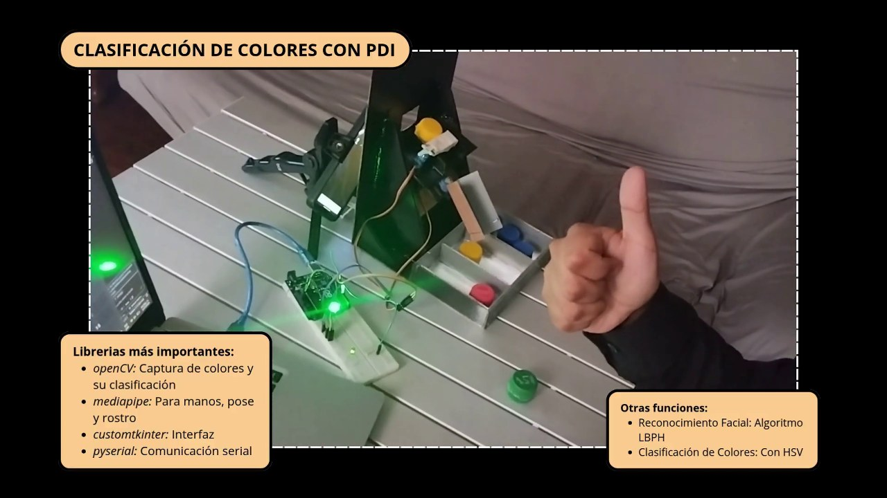
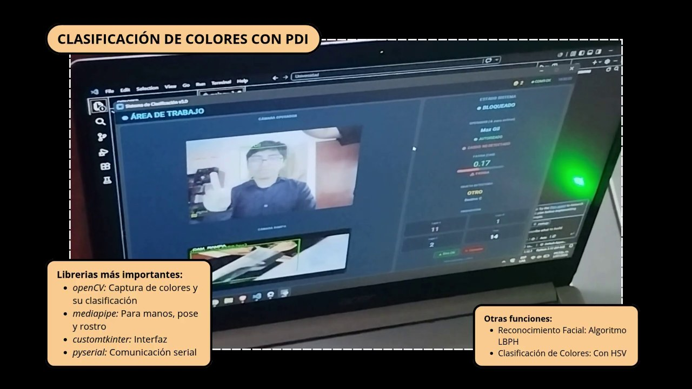
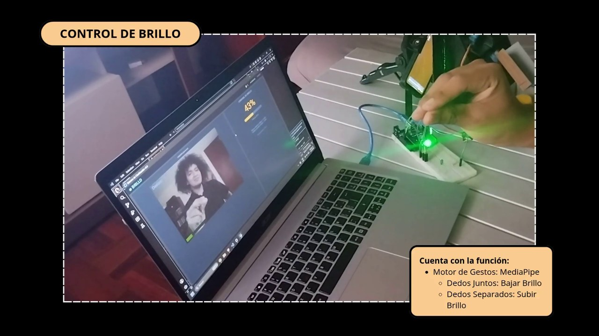
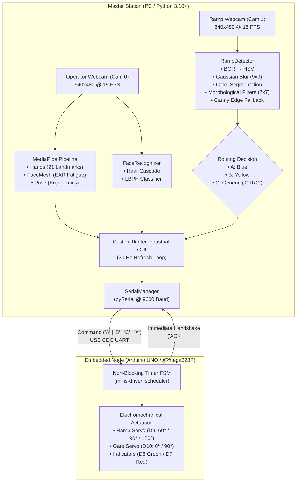

# Smart Vision Sorting System

[](https://python.org)
[](https://opencv.org)
[](https://mediapipe.dev)
[](https://arduino.cc)

A cyber-physical sorting system combining a multi-threaded PC vision/HMI station (Python, OpenCV, MediaPipe, CustomTkinter) with an Arduino UNO microcontroller running a non-blocking, timer-driven Finite State Machine for gravitational physical sorting via dual servomotors over UART.

---

## 📷 Demonstration

| Physical Sorting Mechanism | Dual-Camera Industrial HMI | Contact-Free Gesture Control |
| :---: | :---: | :---: |
|  |  |  |
| *Gravitational ramp, servo routing, Arduino UNO controller, and gestural "OK" confirmation.* | *Live dual video feeds, LBPH facial recognition, EAR fatigue monitoring, and production counters.* | *Contact-free navigation and continuous optical parameter calibration (pinch gesture).* |

---

## 📌 Project Overview

Industrial automation environments increasingly demand flexible human-machine collaboration that minimizes physical contact, guarantees operator authentication, and maintains responsive embedded actuator control.

The **Smart Vision Sorting System** implements an end-to-end hardware/software co-design:
1. **Inspection Vision:** Color-based and generic contour detection on an inclined gravity feed using HSV color segmentation separating chromatic information from the value component, combined with non-linear morphological operations.
2. **Contact-Free HMI:** Full menu navigation and operational control via hand gestures using 21 3D landmarks from **MediaPipe Hands**, stabilized with temporal majority voting.
3. **Biometric Safety Gating:** Operator identification using **Haar Cascade** face detection and **LBPH** (Local Binary Patterns Histograms), alongside drowsiness detection via **MediaPipe FaceMesh** EAR (*Eye Aspect Ratio*) and ergonomic posture evaluation using **MediaPipe Pose**.
4. **Embedded Actuator Control:** An **Arduino UNO** governing a directional chute servo and a gravity release gate servo via a non-blocking timer-driven state machine with bidirectional UART handshaking.

---

## 📐 System Architecture

The project operates as a **master-slave cyber-physical architecture**: the host PC handles all computationally intensive image processing, machine learning inference, and UI state management, while the microcontroller executes non-blocking timer-driven embedded actuator control.




---

## 🔬 Computer Vision Pipeline

Piece detection and classification on the ramp are implemented in [`src/main.py`](src/main.py) (`RampDetector`):

1. **Color Space Transformation:** Converts incoming frames from BGR to HSV (`cv2.cvtColor`), isolating hue ($H$) and saturation ($S$) from luminance ($V$) variations.
2. **Noise Reduction:** Applies a $9\times 9$ Gaussian blur kernel (`cv2.GaussianBlur`) to attenuate high-frequency sensor noise.
3. **Chromatic Segmentation:** Binarizes frames using calibrated ranges via `cv2.inRange`:
   * **Blue:** $H \in [100, 130]$, $S \in [80, 255]$, $V \in [40, 255] \rightarrow$ Destination `'A'` (Servo $120^\circ$).
   * **Yellow:** $H \in [20, 35]$, $S \in [80, 255]$, $V \in [80, 255] \rightarrow$ Destination `'B'` (Servo $90^\circ$).
4. **Morphological Filtering:** Filters binary masks using an **elliptical $7\times 7$ structuring element** (`cv2.getStructuringElement(cv2.MORPH_ELLIPSE, (7, 7))`):
   * `cv2.MORPH_CLOSE`: Fills internal voids and specular highlights.
   * `cv2.MORPH_OPEN`: Suppresses spurious disconnected background noise.
5. **Contour Extraction:** Detects external contours (`cv2.findContours`) and filters by active area (`MIN_AREA = 2000` px).
6. **Generic Contingency Detection (`_detect_any_object`):** If neither blue nor yellow meets the threshold, the system runs Canny edge detection (thresholds 40, 120), elliptical dilation ($9\times 9, 2\text{ iterations}$), and morphological closing ($9\times 9$). Any object with area $> 2500$ px is categorized as `"OTRO"` and routed to Destination `'C'` (Servo $60^\circ$).

---

## ✋ Gesture-Based HMI

The user interface incorporates hands-free navigation implemented in `GestureEngine`:

* **Landmark Tracking:** Tracks 21 hand landmarks in normalized coordinates using `MediaPipe Hands`.
* **Anti-Flicker Majority Voting:** Landmark classifications are buffered in circular queues (`collections.deque(maxlen=5)`). A statistical majority voting filter (`_vote`) eliminates single-frame tracking noise, preventing accidental timer resets.
* **Hysteresis Margin:** A threshold margin ($\text{margin} = 0.02$) prevents false state transitions when fingers are partially extended.
* **Gestures & Timers:**
  * **Menu Navigation (1 to 4 fingers, 1.5s hold):** Switches between Work Area, Brightness, Sign Language, and Posture screens.
  * **Access AR Filters (Fist in Menu, 1.5s hold):** Navigates to Option 5.
  * **Return to Main Menu (Open Palm 5 fingers, 1.5s hold):** Exits current view back to Menu.
  * **Classification Step Confirmation (Thumbs-Up / "OK", 0.8s hold):** Steps through the classification state machine (`BLOQUEADO` $\rightarrow$ `DETECCIÓN` $\rightarrow$ `ESPERA CONF.` $\rightarrow$ `CLASIFICANDO`).
  * **Emergency Stop / Abort (Fist in Work Area, 0.5s hold):** Aborts active sorting, resets state, and transmits `'X'` to Arduino.
  * **Biometric Trigger (Peace Sign ✌️, 0.6s hold):** Triggers facial authentication.
  * **Continuous Parameter Control (Pinch Gesture):** Euclidean distance between thumb (landmark 4) and index fingertip (landmark 8) dynamically scales GUI display brightness.

---

## 👤 Biometric Operator Authentication & Safety

Safety and health compliance are integrated into the primary loop:

* **Face Recognition (`FaceRecognizer`):**
  * Detects frontal faces via OpenCV Haar Cascade (`haarcascade_frontalface_default.xml`).
  * Normalizes ROIs via histogram equalization (`cv2.equalizeHist`) and resizing to $200\times 200$ pixels.
  * Classifies identities using Local Binary Patterns Histograms (`cv2.face.LBPHFaceRecognizer`) against a threshold distance of $115.0$ (`LBPH_THRESH`).
  * **Safety Interlock:** The classification workflow is interlocked; until an enrolled operator is recognized (`self._op_auth == True`), gestural and manual sorting commands remain blocked.
* **Drowsiness Monitoring (`EarDetector`):**
  * Computes the *Eye Aspect Ratio* (EAR) across 6 interpalpebral landmarks per eye using `MediaPipe FaceMesh`:
    $$\text{EAR} = \frac{\|P_2 - P_6\| + \|P_3 - P_5\|}{2 \|P_1 - P_4\|}$$
  * An alert (`⚠ FATIGA`) is displayed if $\text{EAR} < 0.22$.
* **Ergonomics Monitoring (`BodyAnalyzer`):**
  * Utilizes `MediaPipe Pose` to evaluate shoulder tilt and neck alignment ($\Delta y > 30\text{ px}$), alerting prolonged improper posture.

---

## ⚡ Embedded Control (Arduino UNO)

The embedded node runs a **non-blocking timer-driven Finite State Machine (FSM)** in [`arduino/prototipo_arduino_v2/prototipo_arduino_v2.ino`](arduino/prototipo_arduino_v2/prototipo_arduino_v2.ino):

* **Scheduler:** Operates within `void loop()` using non-blocking delta checks via `millis() - stateStartMs >= DURATION_MS`, avoiding `delay()` to maintain immediate serial responsiveness.
* **States & Timing:**
  1. `ST_IDLE`: Ready, waiting for commands.
  2. `ST_RAMP_MOVING` ($600\text{ ms}$): Positions the directional ramp to $120^\circ$, $90^\circ$, or $60^\circ$.
  3. `ST_DOOR_OPENING` ($1200\text{ ms}$): Opens gravity gate to $0^\circ$, dropping the item.
  4. `ST_DOOR_CLOSING` ($800\text{ ms}$): Returns gate to $90^\circ$ (closed).
  5. `ST_RAMP_RETURN` ($800\text{ ms}$): Repositions directional ramp back to $90^\circ$ neutral, deactivates green LED, and returns to `ST_IDLE`.
  6. `ST_CANCEL` ($400\text{ ms}$): Immediate emergency interrupt triggered by `'X'`, illuminating red LED and returning all servos to safe rest position.
* **Total Cycle Duration:** $3.4\text{ seconds}$ per physical piece discharge.

---

## 📡 PC ↔ Arduino Communication Protocol

* **Transport:** USB CDC Virtual Serial (UART).
* **Baud Rate:** 9600 baud, 8N1.
* **Timeout:** $2.0\text{ seconds}$ (`ACK_TIMEOUT`).

| Sender | Payload | Description | Receiver Action |
| :--- | :--- | :--- | :--- |
| **PC $\rightarrow$ Arduino** | `'A'` | Route to Destination A (Blue) | Positions ramp to $120^\circ$, executes drop cycle. |
| **PC $\rightarrow$ Arduino** | `'B'` | Route to Destination B (Yellow) | Positions ramp to $90^\circ$, executes drop cycle. |
| **PC $\rightarrow$ Arduino** | `'C'` | Route to Destination C (Generic) | Positions ramp to $60^\circ$, executes drop cycle. |
| **PC $\rightarrow$ Arduino** | `'X'` | Emergency Abort | Enters `ST_CANCEL`, closes gate, centers ramp, turns on Red LED. |
| **Arduino $\rightarrow$ PC** | `"ACK\n"` | Handshake Confirmation | Confirms command validation and cycle initiation (not cycle finish). |

> [!NOTE]
> The `ACK` response is transmitted by Arduino **immediately upon validating the command** and initiating the FSM transition. It confirms that the command was accepted and execution has begun; it does not indicate mechanical completion of the multi-second drop sequence.

---

## 🔌 Hardware Setup

### Bill of Materials
* 1x Arduino UNO R3 (Microchip ATmega328P)
* 2x SG90 Micro Servos ($5\text{V}$, PWM-controlled)
* 2x 5mm LEDs (Green: status, Red: emergency) + $220\,\Omega$ current-limiting resistors
* 1x Solderless Breadboard & jumper wires
* 1x Gravity ramp structure with pivoting chute, retention gate, and 3 sorting bins
* 2x Video acquisition sources:
  * Camera 0: Integrated laptop webcam (operator HMI & biometrics)
  * Camera 1: External USB webcam or smartphone via Iriun Webcam (ramp inspection)

### Wiring Pinout

| Peripheral | Arduino UNO Pin | Function |
| :--- | :---: | :--- |
| **Ramp Servo (Signal)** | **D9** | Controls chute angle ($60^\circ / 90^\circ / 120^\circ$) |
| **Gate Servo (Signal)** | **D10** | Controls gravity retention gate ($0^\circ\text{ open} / 90^\circ\text{ closed}$) |
| **Green LED (Anode)** | **D6** | Active process indicator |
| **Red LED (Anode)** | **D7** | Emergency cancellation indicator |
| **Power Rails** | **5V / GND** | Power distribution for servos and LEDs |

---

## 💻 Software Stack

* **Language:** Python 3.10+
* **Computer Vision:** OpenCV (`opencv-python`, `opencv-contrib-python`)
* **ML Inference:** Google MediaPipe (`mediapipe`)
* **Graphical Interface:** CustomTkinter (`customtkinter`) & Pillow (`Pillow`)
* **Serial Communications:** pySerial (`pyserial`)
* **Scientific Computing:** NumPy (`numpy`)
* **Embedded Platform:** Arduino C++ / AVR toolchain

---

## 📁 Repository Structure

```text
smart-vision-sorting-system/
├── .gitignore                           # Git ignore rules (excludes local raw media and datasets)
├── README.md                            # Comprehensive technical documentation
├── requirements.txt                     # Python dependencies
├── arduino/
│   └── prototipo_arduino_v2/
│       └── prototipo_arduino_v2.ino     # Arduino firmware with non-blocking millis() FSM
├── docs/
│   ├── .gitkeep
│   ├── SISTEMA INTELIGENTE DE CLASIFICACIÓN - PDS.docx  # Historical university report (prototype v1)
│   └── images/                          # Portfolio demonstration screenshots
│       ├── sorting-demo.jpg             # Physical ramp and gestural sorting
│       ├── operator-authentication.jpg  # Dual-camera HMI, biometrics, and EAR
│       └── gesture-hmi.jpg              # Contact-free pinch gesture calibration
└── src/
    ├── __init__.py                      # Package initialization
    ├── config.py                        # System constants, HSV ranges, and pin mappings
    ├── main.py                          # Multi-threaded vision, HMI, and serial orchestrator
    └── operadores/
        └── .gitkeep                     # Local operator face dataset directory (git-ignored)
```

---

## 🚀 Installation & Setup

### 1. Clone the Repository
```bash
git clone https://github.com/LE0ST/smart-vision-sorting-system.git
cd smart-vision-sorting-system
```

### 2. Configure Python Environment
```bash
python -m venv .venv

# On Windows:
.venv\Scripts\activate

# On Linux/macOS:
source .venv/bin/activate

pip install -r requirements.txt
```

### 3. Flash Arduino Firmware
1. Connect the Arduino UNO via USB.
2. Open [`arduino/prototipo_arduino_v2/prototipo_arduino_v2.ino`](arduino/prototipo_arduino_v2/prototipo_arduino_v2.ino) in the Arduino IDE.
3. Select board **Arduino Uno** and your active serial port.
4. Click **Upload**.

---

## 🎮 Running the Application

Verify your serial port configuration in [`src/config.py`](src/config.py) (`SERIAL_PORT = "COM9"` by default on Windows). Then start the main station:

```bash
python src/main.py
```

### Hardware Simulation Mode
If an Arduino UNO is not connected or fails to open on the specified serial port, `SerialManager` logs:
```text
[Serial] Serial NO conectado — simulación activa
```
The application enters **software simulation mode**: it prints simulated command dispatches (`[Serial] Sim 'A'`) and returns automatic mock `ACK` responses after $300\text{ ms}$. This enables complete testing of the GUI, cameras, MediaPipe gestures, and computer vision pipelines without physical hardware connected.

---

## 👥 Operator Dataset & Privacy Notice

To protect personal privacy, operator training images are excluded from version control via `.gitignore`.

In a clean repository clone, the face recognizer initializes with no training images (`self._trained == False`), returning `"Desconocido"`. Because the system gates classification on operator authorization, the sorting sequence will log `Operador no autorizado`.

### Enrolling an Operator:
1. Capture 3–5 frontal photos of the operator's face.
2. Place them in `src/operadores/` following the naming convention:
   ```text
   src/operadores/
   ├── juan_perez_1.jpg
   ├── juan_perez_2.jpg
   └── juan_perez_3.jpg
   ```
3. Restart `src/main.py`. The system trains the LBPH model dynamically in-memory on startup.
4. In the Work Area, present the peace sign (✌️) to authenticate.

---

## ⚠️ Known Engineering Limitations

* **Illumination Sensitivity:** Chromatic segmentation relies on static HSV threshold bounds. Extreme shifts in ambient lighting or direct sunlight can affect segmentation accuracy.
* **Serial Port Hardcoding:** The target COM port is defined statically as `COM9` in `src/config.py:16` and requires manual modification if assigned a different port.
* **In-Memory Biometric Model:** LBPH training executes dynamically at launch rather than loading from a pre-serialized `.xml` model file.
* **Biometric Cold-Start:** Fresh clones require manual placement of operator photos to satisfy the biometric authorization interlock.
* **Monolithic Architecture:** Core business logic, thread management, and CustomTkinter layout routines reside in a single file ([`src/main.py`](src/main.py), 1938 lines).
* **Automated Tests:** The project currently lacks automated unit or regression test suites.

---

## 🏛️ Academic Context & Authors

This project was co-developed by:
* **Leonardo Yactayo Tolentino**
* **Max Gil Machaca**

Electronic Engineering students at **Universidad Nacional Mayor de San Marcos (UNMSM)**, developed for the *Digital Signal Processing (Procesamiento Digital de Señales - PDS)* course under the academic supervision of Prof. Rafael Bustamante Alvarez.

### Historical Academic Prototype vs. Canonical Implementation
The repository includes the original university technical report ([`docs/SISTEMA INTELIGENTE DE CLASIFICACIÓN - PDS.docx`](docs/SISTEMA%20INTELIGENTE%20DE%20CLASIFICACI%C3%93N%20-%20PDS.docx)), which documents the initial academic prototype (featuring a single hardware pushbutton trigger, 16x2 LCD display, and Douglas-Peucker geometric shape classification). This repository contains the subsequent canonical implementation, expanding the system into a multi-threaded dual-camera station featuring gestural HMI navigation, MediaPipe landmarks, and LBPH facial biometric authentication.

---

## 📄 License

Licensing terms have not yet been specified. A license may be added later by agreement of the project co-authors.
